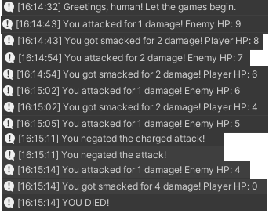

# Turn-Based Console Battle

## Initial Battle System 
* First impression of the system - if the computer was able to play perfectly, it would only attack. The player has a worse damage output and the heal is only able to stall in the best case (and loses HP in the rest 2/3). So in theory I should lose. 
* First Playtests - Player feels pretty strong
    * The ability to negate all damage is very powerful, because it also blocks the following attack
    * This leads to the game being a bit RNG-heavy, because as the player you want the computer to use Charge as much as possible (to get in free attacks)
* If the computer high-rolls you are dead, because of the difference in damage output and insufficient healing. 
* Almost every game ends up in a state where the player either has around 1-3HP or is dead.
* Healing is pretty much useless, since it can only heal you for the minimum amount of damage, that the enemy deals
* You can infinitely chain Blocks

## Improvement Ideas
* Rework Defend to Deflect - if you deflect a Charge attack, you stun the enemy, causing it to instantly end its turn and skip the next one. Deflecting a normal attack does nothing, otherwise the player can win by spamming this ability and using the free attacks in between stuns. Each stun gives +1 damage to the opponent attacks and +1 to the player heal as well.
* Player attacks deals more damage and also crits stunned opponents. (+100% damage)
* Increased the the computer damage range (2-5).
* Increase MaxHP to 15 for both the the player and 30 for the computer.
* Improve Heal - It now resores between 3 and 6 HP, but resolves on the start of your next turn.
* Give lifesteal (+1HP) to attack.

Might be a bit easy for the player in its current itteration, but it felt fun when I playtested it.
Could implement a stage system, where the coumputer MaxHP increases, giving the opponent more time to ramp up its damage.

