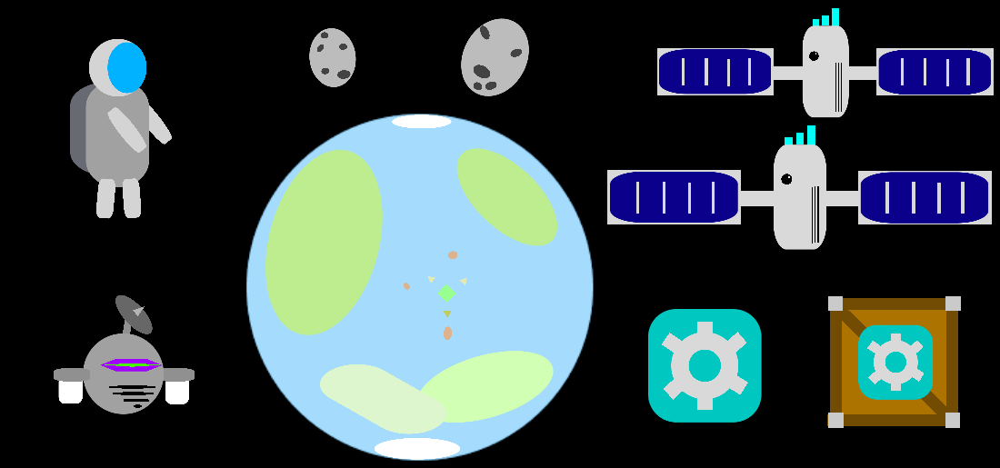

# 2D World

## Design

1. 2 characters - Astronaut and Robot - *Done*
2. 5 objects
    * Planet - *Done* - In the background, change atmosphere color and "thickness" to "generate new planets"
    * Space rock - *Done* - Foreground and Background - Spawn randomly later
    * Satellite - Foreground and Background - Broken Satellites have red Antennas - *Done*
    * Box - *Done*, 
    * ***Parts*** Icon - *Done*
    * Space Ship - *Done*

3. Build world
    * Border of 4 Square Sprites - maybe make them invisible and check for collisions in code - *Done*
        * 1 Satellite - *Done*
        * 2 Boxes of tools - *Done*
        * 1 Asteroid - *Done*
4. Sorting order
    * Character in front of objects - Layer Background - *Done* 
    * Character behind objects - Layer Foreground - *Done*
    * Body parts sorting - Sorting Order inside of Player Layer - *Done*

## Creating the player
1. Player movement - WASD/Arrows - Camera follows the player - Block player from exiting stage - *Done*
2. Press Shift to change speed - 3 States - 100-200-400% - *Done*
3. Press F to change color of individual character parts to a random color - *Done*
4. Switching Between Characters with number keys - *Done*
5. Press Space to activate your ability - Mine Asteroid/Get Tool Crate/Repair Satellite - *Done*

## Initial Build
* Robot mines rocks and turns them into ***Parts*** - *Done*
* Astronaut can interact with crates to gain ***Parts*** - *Done*
* Astronaut uses parts to repair Satellites - *Done*
* Repair all satellites, go to ship, voila! - *Done*
* After tutorial stage, load same scene - Spawn 3 Satellites in random locations. Spawn in flying rocks and crates at random speeds and random angles from the border spawners (aim at center +- 30degrees) - *Done*

## Extra features
* UI for ***Parts*** - *Done*
* Reset colors button - *Done*
* Maybe music? Volume Slider?
* Particles while moving?

## Submission
Export to WebGL
Refer to Homework for posting instructions