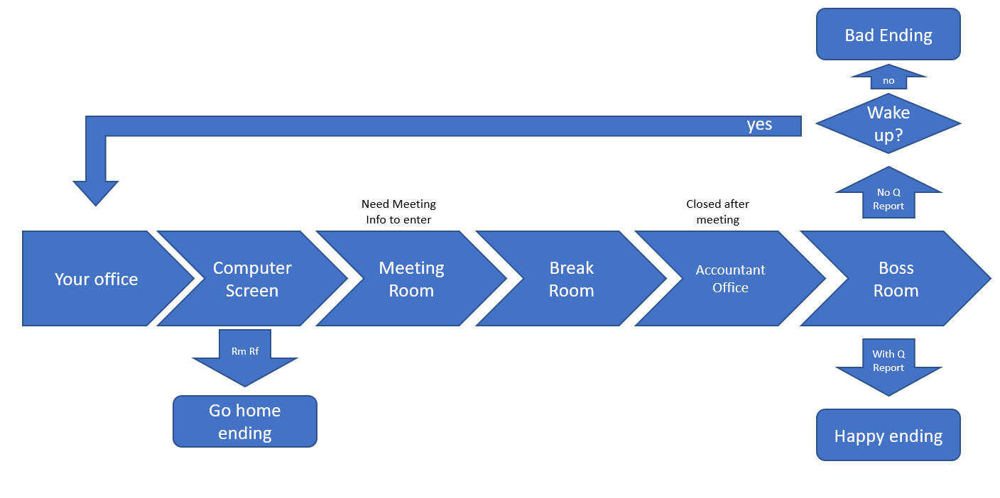

# 
Monday Morning Mystery (working title) 
 /Monday Madness/

## Create story
* Write your own story. There should be at least [6/8/10] different states (or 'rooms') with multiple choices. -- DONE
* At least [1/2/3] states are locked behind some kind of condition (e.g. collect a key to open a door, earn money to buy food, flip a switch to activate a machine, find a gun to kill a zombie, etc.). -- DONE
* There are at least two different endings. An ending is a state without any further choices. -- DONE
* There is one additional secret ending. This is reached by going out of your way to do something that is not part of the main story. -- DONE

### Rooms /States/
0. Title Screen
1. Your office
2. Computer screen (maybe have a secret ending where you sudo rm rf everything and just go home)
3. Meeting room 
4. Break room - sleeping pills in medicine cabinet - consume to reset day
5. Accountant's office (???) - only open before daily 
6. Boss Room

 

  

## Game Loop
* Create a main menu. It should at least contain your game's title and a button to start your game. Make sure that all UI elements in your game scale correctly with the screen size. -- DONE
* Create the basic UI elements for your game. There should be one text that shows your story, multiple texts to show the player's choices and a button to open the options menu. -- DONE
* The player is always in one state and can make choices to go to a different state. The easiest way to implement this would be a simple state machine using an enum. The choices are displayed as text elements. Clicking on a choice loads the next room. -- DONE
* [Hard] The options button toggles a menu on or off. This menu should contain a button that brings the player back to the main menu and a second button that displays a walkthrough of your game. -- DONE

 

  

## Audio and Graphics
* Add at least two different music tracks to your game and play a sound effect whenever the player makes a choice. You can use the files from the package or use your own. -- DONE
* [Hard] Add a UI slider to the options menu that changes the audio volume and a text that shows the current volume. This setting should be persistent and not reset after going back to the main menu. -- DONE
* [Hard] Add graphics to your rooms. You can either use background illustrations, or you can decorate the UI with random images that fit your story (see example screenshot on the  icon). -- DONE